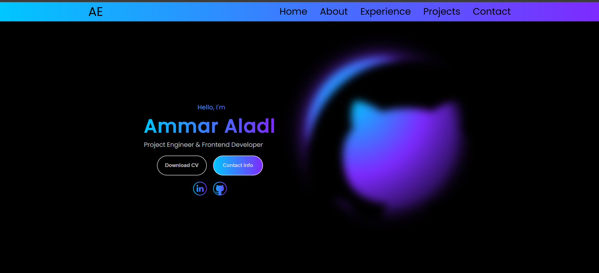
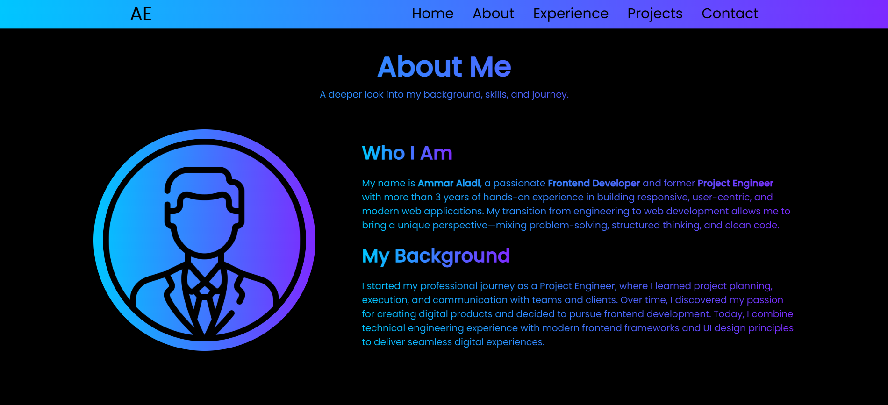
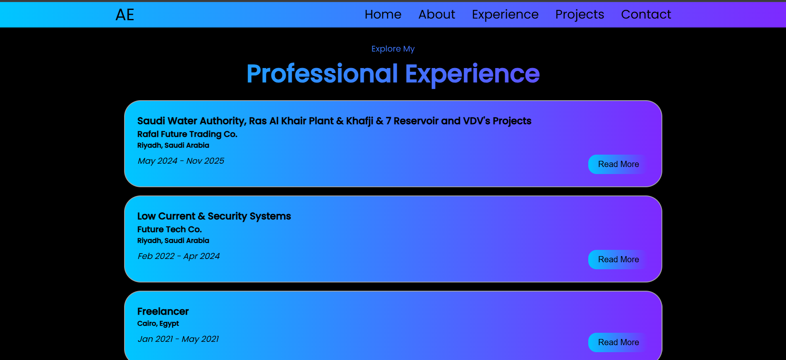
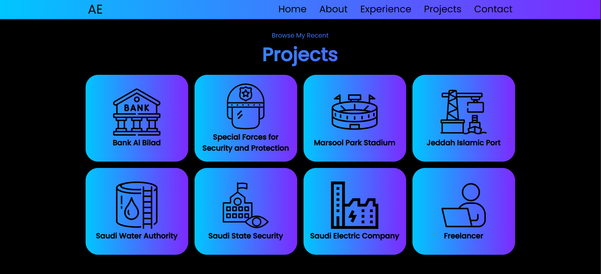
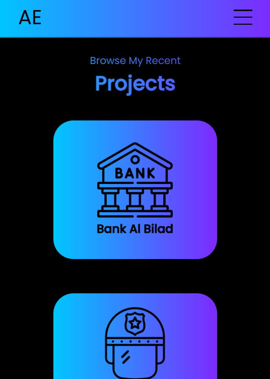
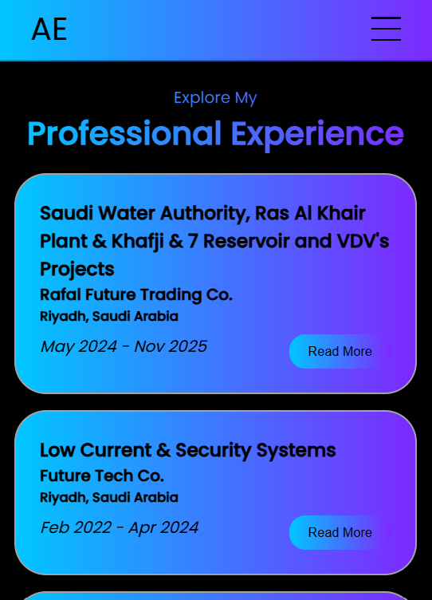

# Personal Portfolio Website 🌟

Welcome to my **Personal Portfolio** website! This site showcases my skills, projects, and contact information — perfect for presenting yourself to employers, collaborators, and recruiters.

🔗 **Live Demo:** https://ammaraladl.github.io/Portfolio/

---

## 📌 Overview

This portfolio is a sleek, responsive website built with **HTML, CSS, and JavaScript**. It serves as a personal branding page that:

- Highlights key skills and experiences
- Displays featured projects
- Provides a way to contact me
- Showcases modern, clean design

---

## 📸 Screenshots

Here are some snapshots of the portfolio:

### Home Section

### About / Skills Section

### Experience Section

### Projects Section

### (Responsive View)

### (Responsive View)

---

## 🛠 Built With

This project was created using:

- **HTML5**
- **CSS3**
- **JavaScript (ES6+)**
- **Responsive Design Principles**

No frameworks — just solid front-end fundamentals.
